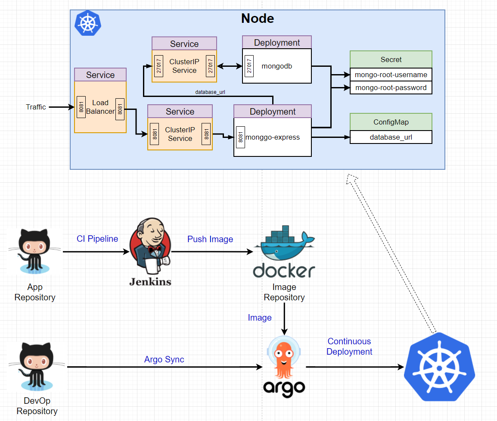
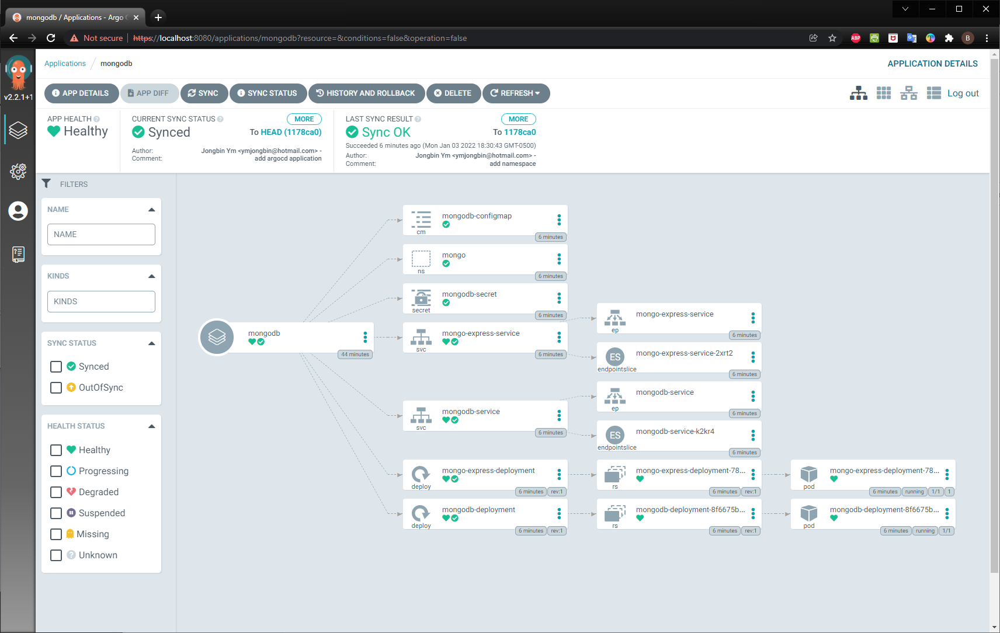
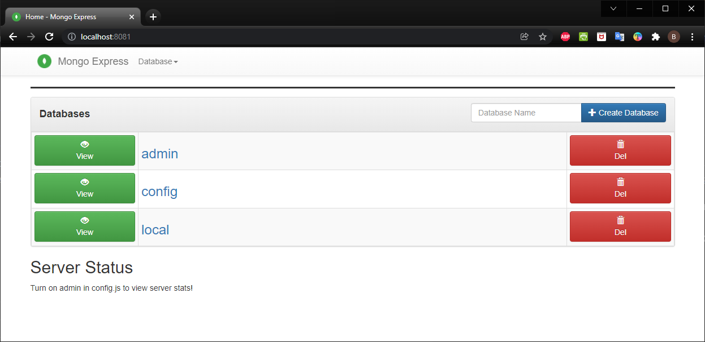

# mongodb-express-k8s

<h3>Design Architecture </h3>

Here is a diagram that we want to implement example of Microservice with Kubernetes, MongoDB, MongoDB Express & ArgoCD

.

<h3>ArgoCD Application </h3>

Automates the deployment of the desired application states in the specified target environments

.

| Requirements      | Description |
| ---- | --- |
| ArgoCD install           | [Getting Start](https://argo-cd.readthedocs.io/en/stable/getting_started/)       |
| Mongo DB Express        | [ Environnement Variable](https://github.com/mongo-express/mongo-express)        |
<h3>MongoDB Express UI </h3>

Web-based MongoDB admin interface, written with Node.js and express

.

<h3>   </h3>
<h3> How to run it in local </h3>
<ol>
  <li>RUN <b>Docker Desktop</b> for running <b>Docker</b> and <b>Kubenetues</b></li>
  <li>kubectl create namespace argocd</li>
  <li>kubectl apply -n argocd -f https://raw.githubusercontent.com/argoproj/argo-cd/stable/manifests/install.yaml</li>
  <li>kubectl patch svc argocd-server -n argocd -p '{"spec": {"type": "LoadBalancer"}}'</li>
  
<b>Get ArgoCD admin password</b>

  <li>kubectl -n argocd get secret argocd-initial-admin-secret -o jsonpath="{.data.password}" | base64 -d; echo</li>
  
<b>WAIT UNTIL all pods running state</b>

  <li>kubectl get all -n argocd</li>
  <li>kubectl port-forward svc/argocd-server -n argocd 8080:443</li>
  <li><b>Launching Chrome and access http://localhost:8080</b></li>
  <li><b>Login ID: admin, password: output of #5</b></li>
  <li>kubectl get all -n argocd</li>
  
<b>Running Kubenetues project</b>

  <li>kubectl apply -f application.yaml</li>
  
<b>Watch ArgoCD's application, wait until all containers are running without problem</b>

  <li><b>To access Mongo Express http://localhost:8081</b></li>
</ol>

<h3> How to clean up all of containers</h3>
<ol>
     
kubectl delete all --all --namespace=argocd

</ol>

